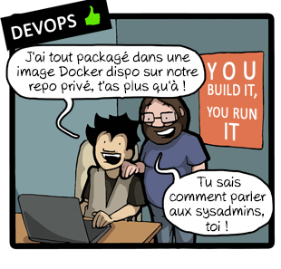

# Qu'est-ce que Docker ?




Notes :
Un sysadmin et un développeur qui <br> 
travaillent chacun pour soi : un cas classique <br>
Ils n'utilisent pas les mêmes outils <br>
Chacun a ses résponsabilité et en veut pas d'autres  <br>
Il manque un outil commun utile pour les deux  <br>
Mais pas les VM : trop lourdes et pas versionnables ko
pour les developpeurs. <br>
Docker convient à tous les deux  <br>
Et est devenu un standard de facto <br>


## Histoire de Docker

*Quelques dates* :

<!-- .element class="fragment" -->
- **mars 2013 :** dotCloud livre Docker en Open Source

<!-- .element class="fragment" -->
- **aout 2013 :** eBay, Uber, Cloudfare utilisent Docker

<!-- .element class="fragment" -->
- **octobre 2013 :** DotCloud devient Docker Inc.

<!-- .element class="fragment" -->
- **décembre 2013:** Google Compute Engine supporte Docker

<!-- .element class="fragment" -->
- **avril 2014:** Amazon Web Service supporte Docker

<!-- .element class="fragment" -->
- **octobre 2014:** Partnership avec Microsoft

<br>
<!-- .element class="fragment" -->
*Quelques chiffres* :

<!-- .element class="fragment" -->
- 150+ Docker Meetup dans 50 pays

<!-- .element class="fragment" -->
- 18,000+ Github stars

<!-- .element class="fragment" -->
- 100M+ Docker Engine downloads

<!-- .element class="fragment" -->
- 730+ développeurs de la communauté ont contribué


## Ok mais....

<br>


Notes :
On a compris a quoi sert Docker et on a  <br>
vu son histoire.  <br>
Mais nous ne savons toujours pas qu'est <br> 
ce que c'est.


## Quelques définitions

<br>
> "Docker is an open platform for developers and sysadmins to build, ship, and run distributed applications."

<p align="right">*docker.com*
&nbsp;&nbsp;&nbsp;&nbsp;&nbsp;
&nbsp;&nbsp;&nbsp;&nbsp;&nbsp;
&nbsp;&nbsp;&nbsp;&nbsp;&nbsp;
&nbsp;</p>

<br>
<br>
> "Docker is an open-source project that automates the deployment of applications inside software containers"

<p align="right">*wikipedia.org*
&nbsp;&nbsp;&nbsp;&nbsp;&nbsp;
&nbsp;&nbsp;&nbsp;&nbsp;&nbsp;
&nbsp;&nbsp;&nbsp;&nbsp;&nbsp;
&nbsp;</p>

Notes :
Ce qu'il faut retenir ici c'est :

- Pour développeurs et sysadmin 
- Pour builder et livrer
- Pour automatiser
- Des conteneurs


## Une métaphore - le transport de conteneurs


Notes :
Mais c'est peut-être pas encore très clair...<br> 
Une métaphore peut être plus efficace que 1000  <br>
définitions. <br>
Docker a pas mal de similitudes avec le transport par conteneurs.  <br>
Le véhicule représente le systeme hôte et la marchandise correspond aux logiciel. <br>

- de la même facon que les conteneurs de marchandises peuvent etre <br> 
transportés par n'importe quel vehicule, les conteneurs <br>
de logiciels peuvent tourner sur n'importe quel hôte. <br>
- avec les conteneurs, le transport de marchandise est plus rapide <br>
et, de même, le deployment de logiciel est plus rapide.
- dans les deux cas on est devant une solution qui est devenue <br>
un standard


## Une métaphore - une révolution


<figure style="position: absolute; bottom: 30px; right: 50px;">
    
</figure>

Notes :
Apres être devenu un standard le transport par conteneur 
a été une révolution  <br>
C'est très bien décrit dans ce livre de l'année dernière  <br>
qui est aussi le livre préféré de Bill en 2013. Curieux...


## Détails techniques - Architecture


Notes :
Engine : la partie qui gère les conteneurs
Client : la command line. Peut se connecter à un engine distant 
Index : c'est le docker hub, le catalogue des images


## Détails techniques - Isolation
<br>
> <p align="center">"chroot on steroids"</p>


Notes :
les versions modernes du kernel disposent des outils  <br>
pour isoler les applications :

- chroot : premier systeme de isolation (pour le filesystem)
date du '79
- cgroups : control goups pour isoler les 
resources (CPU, RAM, I/O etc...). ils sont apparu dans 
kernel v2.6.24 
- namespaces : pour isoler les PID, chaque groupe aura 
ses PID, ses mount, IPC etc...
- lxc : exploite cgroups et namespaces
- libvirt : wrapper des différents types de hypervisors
- chroot : isolation du filesystem
- libcontainer : depuis docker 0.9, une strate d'abstraction supplémentaire et rend Docker indépendant de LXC


##  Détails techniques : LXC vs Docker

Depuis v0.9 Docker ne dépend plus de LXC

Qu'est Docker apporte en plus de LXC :

- Environnment portable de deployment
- Build automatisé à partir du Dockerfile
- Versioning des images
- Images réutilisables comme base images d'autres images
- Docker Hub
- Ecosystème

##  Détails techniques : Union mount


```go
// Slice of drivers that should be used in an order
 priority = []string{
 "aufs",
 "btrfs",
 "devicemapper",
 "vfs",
 "overlayfs"}
```

Notes :
Copy on write ou Union mount est une technique pour <br>
faire un mount de plusieurs filesystem qui ressemble <br>
a un fs unique.
Docker se basait sur aufs au début mais d'autres systemes<br>
de union mount sont apparus entretemps
http://developerblog.redhat.com/2014/09/30/overview-storage-scalability-docker/
