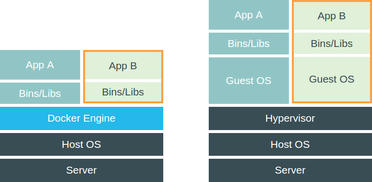

# Qu'est-ce qu'une VM

## Comparaison de l'architecture VM/Conteneur
 

## Quand utiliser une VMs

- Quand l'application dépend d'une version précise du kernel
- Quand la sécurité du conteneur est importante
- Sur Windows et Mac

## Quand utiliser les deux ?

- Sur Windows et Mac
- Quand on veut reproduire un environement de prod

## Quand utiliser un conteneur
 
 
Dans tous les autres cas ;-) 
