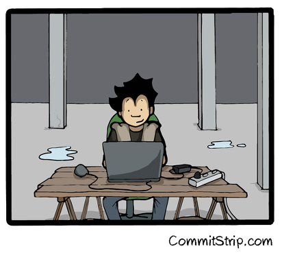

# Hands-on n.1




## Hands-on #0 : Configuration


```bash
curl -sSL https://raw.githubusercontent.com/Zenika/NC-Docker-Decouverte/master/Hands-on/setup_debian.sh | bash
```


## Hands-on #1 : Démarrer et arreter un conteneur

- Démarrer un conteneur Docker à partir de l'image **debian:jessie** en ouvrant un shell bash en mode interactif
    + ``run`` options ``-t -i --rm``
- Démarrer un conteneur Docker à partir de l'image **zenika/nodejs-sample-app:latest** en mode detached pour démarrer un serveur nodejs
    + ``run`` option ``-d`` 
- Récuperer l'identifiant du conteneur (ps), et arretez-le (stop)
    + ``ps`` options
        - ``-a`` : liste tous les conteneurs (démarrés, arrétés ou en pause)  
        - ``-l`` : liste uniquement le dernier container 


## Hands-on #2 : Conteneurs vs VMs - Resources

- Démarrer 50 conteneur : 
    -  Vérifier les resouces utilisées avant et après (avec ``htop`` par exemple)
    -  Utiliser l'image **zenika/nodejs-sample-app:latest**
    -  En mode detached
- Démarrer 15 VM avec nodejs et vérifier les resources utlisées


## Hands-on #3 : Conteneurs vs VMs - Isolation
- Chercher le PID des process nodejs des 50 conteneurs démarrés auparavant en utilsant la commande ``ps`` 
- Essayer de killer les process
- Faire la même chose pour une VM 

