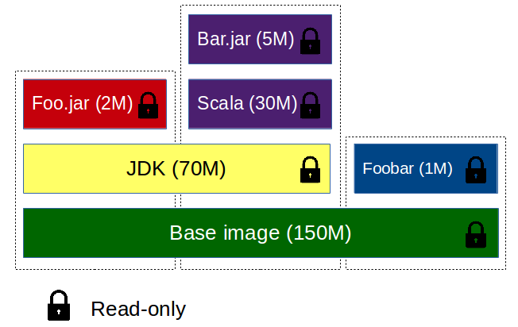

## Cycle de vie

- Images (*Construction*)
    - Template
    - Lecture seule
- Registry (*Distribution*)
    - Liste d'images
- Conteneurs (**Runtime**) :
    - Basé sur une image
    - Dispose d'un état

Notes :
- Tous est HASH (comme git)


## Images (1/2)

Template multi-layer pour les conténeurs, héritage



Notes :
- Filesystème en oignon => gain de place


## Images (2/2)

Commandes usuels

- images : liste les images disponible en local
```bash
REPOSITORY  TAG     IMAGE ID      CREATED     VIRTUAL SIZE
debian      jessie  b427819b829a  4 days ago  715.6 MB
# […]
```
- search : effectue une recherge sur le *hub* d'images
- rmi : supprime une image disponible en local
- build : construit une image à partir d'un ``Dockerfile``

Notes :
- rmi : supprime également les tags, vérifie cohérence avec les
  enfants, etc..


## Dockerfile (1/2)


```bash
FROM debian:jessie                  # Basé sur Debian
MAINTAINER John Doe <john@doe.com>

RUN apt-get -y update               # Une commande
RUN apt-get -y install git \ 
    openjdk-7-jre                   # Ou sur plusieurs lignes
RUN ["echo", "ou comme ça"]

ADD http://bit.ly/1HyjEeA           # Ajout depuis un URI
COPY target/foobar.jar /            # Copie d'un fichier

VOLUME ["/data"]                    # Déclaration d'un volume
EXPOSE 8080                         # Exposition d'un port

ENV IN_DOCKER=y                     # Variable d'environnement
WORKDIR /                           # le $PWD de mon processus
CMD ["java", "-jar", "/foobar.jar"]
```

Notes :
- Explain each line of a Dockerfile example
- Chaque étape de la construction d'une image devient un layer
- .dockerignore : permet d'ignorer des fichiers entre le build et
  l'image final, ce qui permet de ne pas allourdir l'image (e.g. un
  répertoire .git, .svn, ..)
- ENTRYPOINT : customizer le point d'entrée du docker (expliquer avec ``cat``)
- Autres : USER, ...


## Dockerfile (2/2)


```bash
$ docker build -t test .
Step 0 : FROM debian:jessie
 ---> aaabd2b41e22
Step 1 : MAINTAINER John Doe <john@doe.com>
 ---> Running in fecfccae398b
 ---> 3d290dc10132
Removing intermediate container fecfccae398b
Step 2 : RUN apt-get -y update
 ---> Running in d72fb9cfda61
# […]
Step 5 : ADD http://bit.ly/1HyjEeA /whale.gif
Downloading [======================>]  1.02 MB/1.02 MB
# […]
Step 11 : CMD java -jar /foobar.jar
 ---> Running in 4239619930e2
 ---> 8ba1ccb146c9
Removing intermediate container 4239619930e2
Successfully built 8ba1ccb146c9
$ docker run -rm -i test1 # it runs !
```


## Conteneurs (1/3)

schema


Notes :
- Run d'un conteneur :
    - Vérifie la présence de l'image, et la télécharge si besoins
    - Créer un conteneur à base de l'image, alloue un système de
    fichier de l'image en read-only et un layer en écriture
    - Configure/ alloue in interface "network" (bridge, ..), setup
      l'adresse IP (dispo dans pool)
    - Exécute le processus demandé et capture les outputs (stdout,
      stderr, ..)
- Un conteneur est nommé (de manière automatique ou manuelle)


## Conteneurs (2/3)

- run : 
- start :
- stop :
- commit :
- create :


## Conteneurs (3/3)

- diff :
- exec :
- rm :
- ps :


## Persistence de l'état des conteneurs

- Commandes qui te font persisté l'état et celle qui ne le font pas


## Volumes
